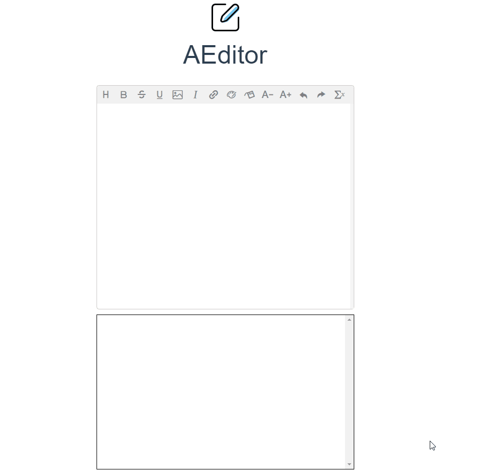

<center></center>
<center><span style="font-size: 50px">AEditor</span><center>

<center>🚀一个可以输入公式的富文本编辑器</center>

## 使用方法

1. 安装

    ```bash
    # 使用npm
    npm i aeditor

    # 使用yarn
    yarn add aeditor
    ```
    
2. 引用

    ```js
    // 导入组件库
    import AEditor from 'aeditor'
    // 注册组件库
    Vue.use(AEditor)
    ```

3. 在Vue文件中使用

    ```Vue
    <template>
      <AEditor v-model="content" />
    </template>
    
    <script>
    export default {
    	name: 'AEditor',
        data() {
            return {
                content: ''
            }
    	}
    }
    </script>
    ```


## 预览



## 要完成的功能

- [ ] 插入标题
- [x] 加粗字体
- [x] 添加删除线
- [x] 添加下划线
- [x] 插入图片
- [x] 将字体改为斜体
- [x] 插入链接
- [x] 改变前景色
- [x] 改变后景色
- [ ] 增大字体
- [ ] 缩小字体
- [x] 撤销操作
- [x] 重做操作
- [ ] 输入公式


## 项目构建

```
npm install
```

### Compiles and hot-reloads for development
```
npm run dev
```

### Compiles and minifies for production
```
npm run build
```

### Run your tests
```
npm run test
```

### Lints and fixes files
```
npm run lint
```


